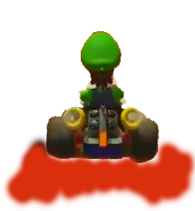
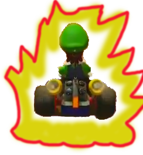

<h2 align="center">PROYECTO MARIO KART</h2>

Juego muy sencillo de Mario Kart, totalmente random la aceleracion, la frenada y el turbo. 
En la frenada se vera un color rojo debajo del coche como este. 
 
Y el turbo se vera una aurora amarilla y roja. 
 
 

<h5>
Proyecto realizado en HTML, CSS y Javascript.
</h5>
