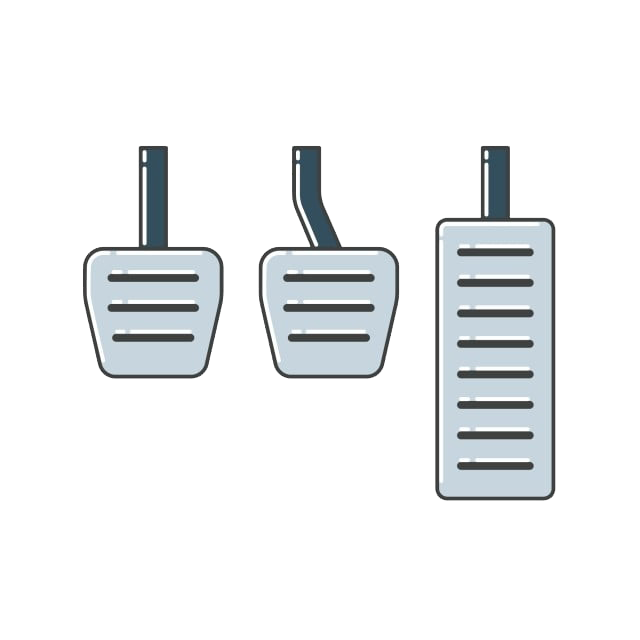

<h2 align="center">PROYECTO MARIO KART</h2>

Juego muy sencillo de Mario Kart, totalmente random la aceleracion, la frenada y el turbo. 
Seleccion de 2 personajes, se pueden repetir y una vez seleccionados se le da con un click a select player. 
En la frenada se vera un color rojo debajo del coche como este. 
 
Y el turbo se vera una aurora amarilla y roja. 
 
Se acelera dandole clicks en el dibujo del pedal. 

<h5>
Proyecto realizado en HTML, CSS y Javascript.
</h5>
